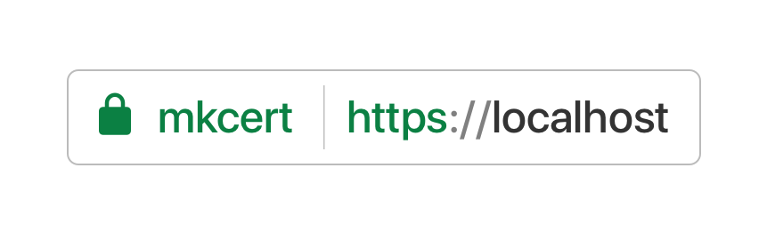

# Learning gRPC  

  

<br/><br/><br/>

## 전제조건 

* Linux or [WSL2](https://learn.microsoft.com/en-us/windows/wsl/install)(Windows)  
* Docker or [Docker Desktop](https://www.docker.com/products/docker-desktop/)(Windows)  
* [`kubectl`](https://kubernetes.io/docs/tasks/tools/)  
* [`Helm`](https://helm.sh/)  
* [`Kind`](https://kind.sigs.k8s.io/)  

<br/><br/><br/>

## 준비하기  

### kind 클러스터와 Docker Registry 만들기  

kind 의 `exportPortMapping` 구성 옵션을 사용하여 호스트에서 kind Node 에서 실행하는 ingress controller 로 포트 포워딩을 할 수 있습니다.  

[`kind-with-registry.sh`](./kind-with-registry.sh) 스크립트 실행하여 kind 클러스터와 Docker Registry 를 만듭니다:  

```bash
./common/kind-with-registry.sh grpc
```

위 명령을 실행하면 *kind-grpc* 라는 클러스터가 생성됩니다.  
`kind get clusters` 명령으로 새로 만든 grpc 클러스터를 확인할 수 있습니다:  

```bash
kind get clusters
```

grpc 클러스터를 삭제하려면 다음 명령을 실행합니다:  

```bash
kind delete cluster --name grpc
```

<br/>

### localhost 에서 https 를 사용하기 위해 `mkcert` 설정하기  

이 가이드는 localhost 를 기준으로 작성되었습니다.  

다음은 localhost 에서 https 를 사용하기 위한 설정입니다.  

일반적인 TLS 인증서를 설정하려면 [kubernetes/ingress-nginx](https://github.com/kubernetes/ingress-nginx)의 [PREREQUISITES tls-certificates](https://github.com/kubernetes/ingress-nginx/blob/main/docs/examples/PREREQUISITES.md#tls-certificates) 과정을 참고하세요.  

[`mkcert`](https://github.com/FiloSottile/mkcert)는 로컬에서 신뢰할 수 있는 개발 인증서를 만드는 도구입니다.  
시스템 루트 저장소에 로컬 CA를 자동으로 생성 및 설치하고 로컬에서 신뢰할 수 있는 인증서를 생성합니다.  



다음 명령을 실행하여 로컬 CA를 생성합니다:  

```bash
mkcert -install
```

다음 명령을 실행하여 지정한 호스트 이름으로 `.pem` 인증서를 생성합니다:  

```bash
mkcert localhost 127.0.0.1
```

다음 명령으로 쿠버네티스에서 사용할 *secret*(tls-secret) 를 만듭니다:  

```bash
kubectl create secret tls tls-secret --cert=localhost+1.pem --key=localhost+1-key.pem
```

<br/>

### 저장소 루트를 환경변수로 정의하기  

가이드에서 경로의 실수를 없애기 위해 저장소 루트 경로를 환경변수 `REPO_ROOT` 로 정의합니다:      

```bash
git clone https://dev-server.com2us.com/cppis/learning-grpc.git && cd learning-grpc
export REPO_ROOT=$(pwd)
```

<br/><br/><br/>

## 소개  

이 글을 읽으시는 분은 [gRPC 소개](https://grpc.io/docs/what-is-grpc/introduction/)를 읽고, [protocol buffers](https://developers.google.com/protocol-buffers/docs/overview) 사용에 익숙하다고 가정하겠습니다.  
튜토리얼 예제는 프로토콜 버퍼의 proto3 버전을 사용합니다: 자세한 내용은 [proto3 언어 가이드](https://developers.google.com/protocol-buffers/docs/proto3)와 [Go 생성 코드 가이드](https://developers.google.com/protocol-buffers/docs/reference/go-generated)에서 확인할 수 있습니다.  

<br/>

### gRPC를 사용하는 이유  

gRPC를 사용하면 `.proto` 파일에서 한 번만 서비스를 정의하고 gRPC가 지원하는 모든 언어로 클라이언트와 서버를 생성할 수 있습니다. 그러면 대규모 데이터 센터 내부의 서버에서 자체 태블릿에 이르기까지 다양한 환경에서 실행할 수 있습니다. 다른 언어와 환경은 gRPC에서 처리합니다. 또한 효율적인 직렬화, 간단한 IDL 및 손쉬운 인터페이스 업데이트를 포함하여 프로토콜 버퍼 작업의 모든 이점을 얻습니다.  

<br/><br/><br/>

## 미션  

### 0. [kind 클러스터에 gRPC 배포하기](mission.0/README.md)  

kind 클러스터에 ingress-nginx, gRPC 를 배포하는 가이드입니다.  

<br/>

### 1. [gRPC 튜토리얼 배포하기](mission.1/README.md)  

kind 클러스터에 [gRPC - Basics tutorial](https://grpc.io/docs/languages/go/basics/) 를 배포하는 가이드입니다.  

<br/><br/><br/>

## [참고자료](references/README.md)  

가이드를 작성할 때 참고했던 자료들입니다.  